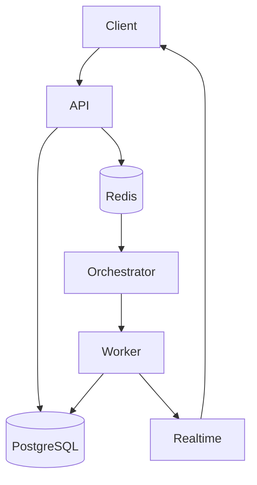

# Architecture Overview

FlowForge is a multi-tenant workflow orchestration engine. The system is split into three main planes:

## Control Plane
- **API** (Fastify + REST API)
- **Auth** (JWT with HS256, Argon2id for password hashing)
- **Scheduler** (cron evaluator using advisory locking / SELECT FOR UPDATE)

## Data Plane
- **Orchestrator** (DAG state machine)
- **Worker** (step executor consuming from Redis Streams)
- **Redis Streams** (broker for queueing and event delivery)

## Observability Plane
- **Realtime Hub** (WebSocket server for pushing execution states)
- **PostgreSQL Logs Table** (partitioned by week for scale)

## Diagram

## Request Flow
1. **Client** → `POST /workflows/:id/runs`
2. **API** inserts a new run row in `runs` and enqueues to the Redis broker.
3. **Orchestrator** dequeues the run, loads its DAG, and enqueues ready steps.
4. **Worker** dequeues step execution messages, runs them, and publishes completion events.
5. **Orchestrator** handles step events, progresses the run FSM, and triggers subsequent steps or finishes execution.
